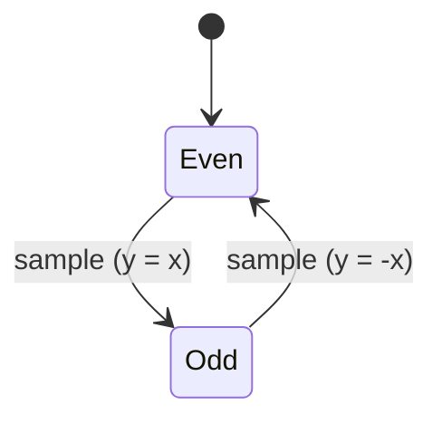

# Software Design Description 201
## Spectral Inverter System


## Implementation Plan
A spectral inverter system was mathematically defined in SDR200  with the following:

$$
y[n] = (-1)^{n} \times x[n]
$$

This implies that the requested algorithm will take form



... Quite the underwhelming algorithm if you ask me.

## Mathematical Observations
This system can be interpreted as multiplication by a discrete cosine. A normalized cosine oscillates between +1 and -1, with a maximum of 1 at n=0.

$$
(-1)^{n} = cos(\pi \times n)
$$

therefore,

$$
y[n] = (-1)^{n} \times x[n] = cos(\pi \times n)
$$

given that the frequency of this cosine wave is specified to be the Nyquist frequency (Fs/2).


###2. Why this matters | The modulation property:

The modulation property (equation 1.91) states

$$
x(t) <==> X(\omega)
$$

and by Euler's formula and the time shifting property (equation 1.88),

$$
x(t)cos(\omega_{0} t) <==> \frac{1}{2} [ X( \omega - \omega_{0} ) + X( \omega + \omega_{0})]
$$

meaning that multiplying any sinusoid by any x(t) will modulate the resulting frequency in some way (except if x(t) is not a periodic function in any way). In other words, x(t) is the envelope and the cosine is the carrier.

####Note: the signal x(t) will have a bandwidth B and the modulated signal will have a bandwidth of 2B. Modulation doubles the bandwidth!

The following can be abstracted from this example

$$
\omega_{0} = \pi \times |\frac{F_{s}}{2}| \\
f + \omega_{0} = f + \frac{F_{s}}{2} => f - \frac{F_{s}}{2}
$$

since the maximum frequency of f is Fs. In other words, the sum of some frequency  *f* and the Nyquist frequency, aliases to the f - Fs/2.


## Simulation
Definitely not needed but this step is best practice. A simple simulation takes a very small amount of time for this implementation though.

```MATLAB
F_s = 10000;           % 10 kHz sample frequency ==> 10 us sample rate
n = 0:499;             % Sample indices
t = n/F_s;

f_in = 1000;
input_signal = sin(2*pi*f_in*t)

spectral_inverted_signal = ((-1).^n) .* input_signal;

figure;
subplot(2,1,1);
plot(t, input_signal, 'b', t, spectral_inverted_signal, 'r');
legend('Input', 'Output')
title('TIME DOMAIN')

subplot(2, 1, 2);
f = linspace(0, F_s/2, .5*length(t));
f_input_signal = abs(fft(input_signal));
f_spectral_inverted_signal = abs(fft(spectral_inverted_signal));

plot(f,f_input_signal(1:length(f)), 'b', f,f_spectral_inverted_signal(1:length(f)), 'r');

legend('Input', 'Output');
title('FREQUENCY DOMAIN');
xlabel('Frequency (Hz)');

```
## Bridging Theory to Hardware
The spectral inversion algorithm assumes bipolar signals in theory. Practically as stated in SDR201, the K22F ADC and DAC are unipoler (unsigned, 0-4095 for a 12 bit resolution).

### Mapping Bipolar Theory to Unipolar Hardware

| Bipolar Domain                                  | Unipolar (12-bit) |
|-------------------------------------------------|-------------------|
| -2048  (12 bits fully saturated including sign) | 0                 |
| 0                                               | 2048              |
| +2047 (11 bits fully saturated)                 | 4095              |

**DC offset:** 2048 is the centerpoint for a practical implementation.

### Theory Translation

We know the bipolar formula to be

$$
y[n] = (-1)^{n} \times x[n]
$$

Meaning that the output will be:
- x[n] when n is even.
- -x[n] when n is odd.

### Unipolar implementation
1. Conversion to unipolar domain:
  - x_bipolar = x_unipolar - DC_OFFSET
2. Apply spectral inversion:
  - y_bipolar = +/- x_bipolar
3. Conversion back to unipolar:
  - y_unipolar = y_bipolar + DC_offset
  - y_unipolar = DC_OFFSET +/- (x_unipolar - DC_OFFSET)

- When n is even:
  - y_unipolar = DC_OFFSET + (x_unipolar - DC_OFFSET) = x_unipolar
- When n is odd:
  - y_unipolar = DC_OFFSET - (x_unipolar - DC_OFFSET) = 2DC_OFFSET - x_unipolar

Translated to C:
```c
if(n % 2 == 0)
{
    y_unipolar = x_unipolar;
}
else
{
    y_unipolar = 2*DC_OFFSET - x_unipolar;
}
```
Which can be condensed to:
```c
bool state = false;

void state_inverter(uint16_t input)
{
    y_unipolar = (state) ? x_unipolar : 2*DC_OFFSET - x_unipolar;
    state ^= 1;
    return y_unipolar;
}
```

which is logically equivalent to
```c

bool state = EVEN;

void state_inverter(uint16_t input)
{
    state ^= 1;
    int16_t signed_input = (int16_t)input - DC_OFFSET;
    signed_input = (signed_input ^ -state) + state;
    return (uint16_t)(signed_input + DC_OFFSET);
}
```
and this will remove branching logic.

## Frequency shift

The sequence {0, 1, 0, -1} is a 4-periodic signal that effectively multiplies the input by:
- cos(πn/2) for the alternating ±1 values
- With zeros inserted (sample dropping)

This modulates the input with Fs/4, shifting spectrum by ±Fs/4. Combined with the zero-insertion (which creates spectral copies at Fs/2), the result is [your analysis here].

**Implementation:** Simple LUT with modulo-4 counter instead of a switch case state machine. This works very simalarly to a swich case actually. The index is passed in and reset (like a clock that counts to 4) then it simply mulitplys, simalar to how a discrete cosine set to half nyquist would.
- state = (state + 1) & 0x03; ensures the counter cycles 0, 1, 2, 3 and then resets
-
## Bit Resolution

My implementation
I started with creating a bitmask by shifting 0xFFFF left. If current_resolution is 4, it shifts by 12-4=8. The mask becomes 0xFF00. Bitwise and ( input & mask), "chops off" the least significant bits of the signal.

