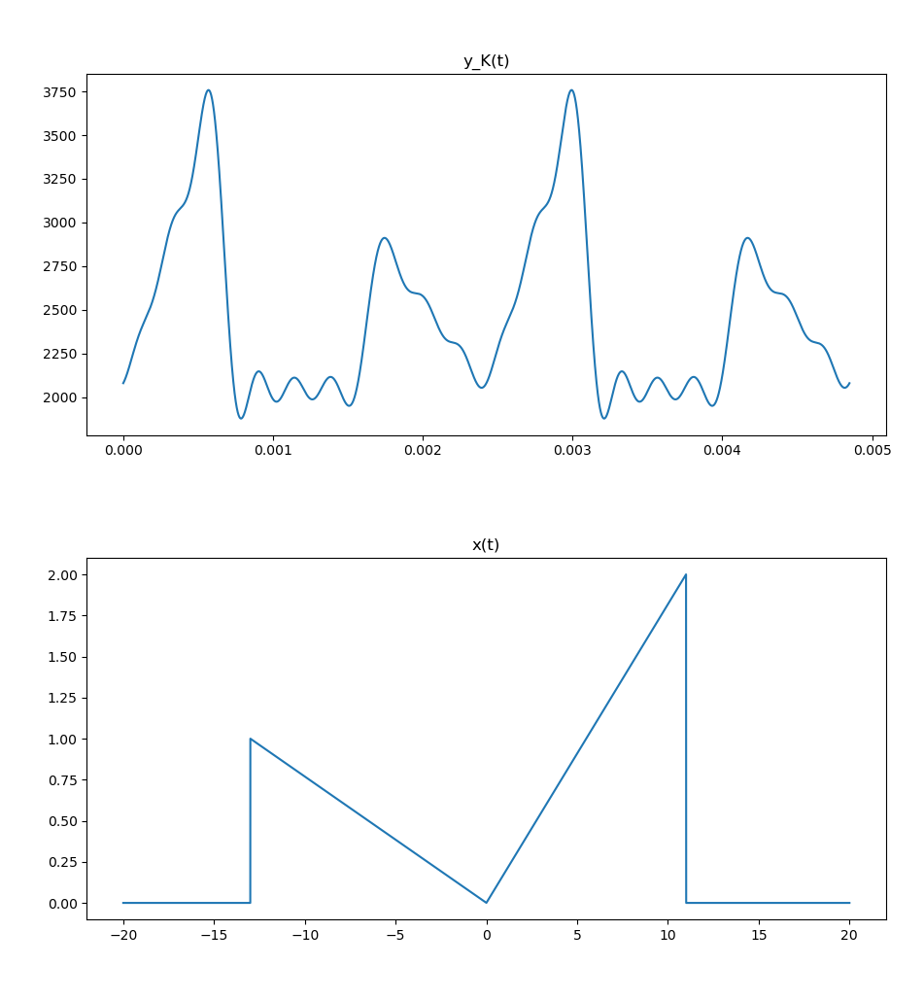
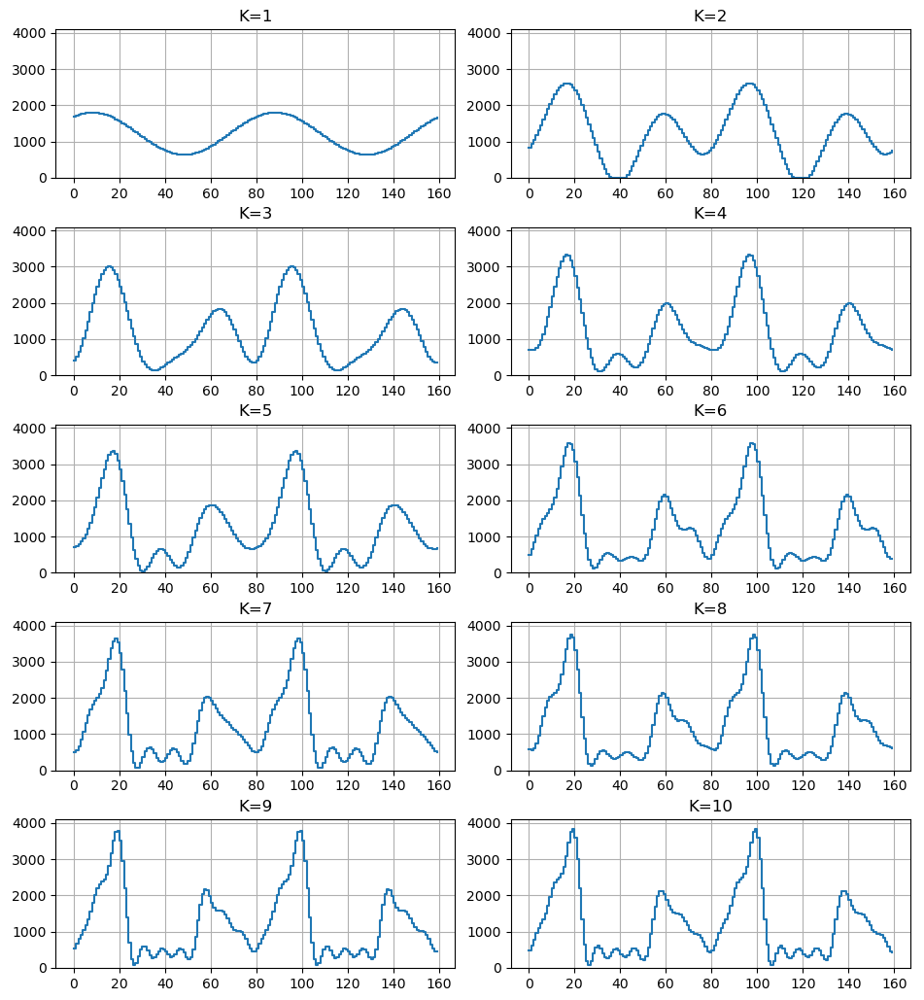
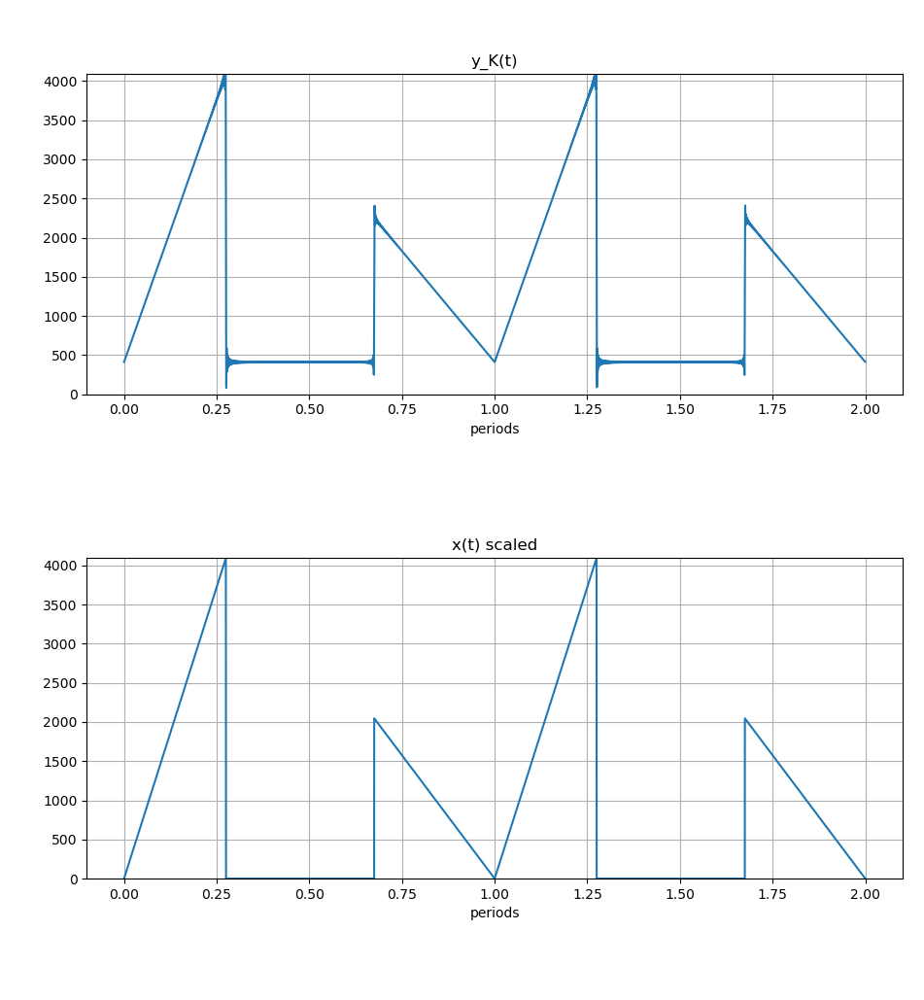

# Software Design Document 301 | Fourier Series Prep Work and Simulation
## Overview
The scope of this document is limeted to describing the theoretical modeling of a Fourier series synthesizer that generates arbitrary periodic waveforms using truncated harmonic summation.

## Mathematical Foundation

### Base Signal Definition

$$
x(t) = \begin{cases}
0 & -20 \leq t < -(B + 10) \\
-t/(B + 10) & -(B + 10) \leq t < 0 \\
2t/(A + 10) & 0 \leq t < A + 10 \\
0 & A + 10 \leq t < 20 \\
x(t + 40) & \forall
\end{cases}
$$

Given:
- **A = 1**
- **B = 3**
In MATLAB
```matlab
A = 1;
B = 3;
T = 40;

t = -40:0.01:40;  % 2 periods

% Map t to one period [-20, 20)
t_mod = mod(t + 20, T) - 20;

x = zeros(size(t));

x(t_mod >= -(B+10) & t_mod < 0)      = -t_mod(t_mod >= -(B+10) & t_mod < 0) / (B+10);
x(t_mod >= 0 & t_mod < (A+10))       = 2*t_mod(t_mod >= 0 & t_mod < (A+10)) / (A+10);

plot(t, x);
title('x(t) - 2 Periods');
xlabel('t');
grid on;
```


### Signal Characteristics
- **Period:** T = 40 units of time
- **Fundamental frequency:** f₀ = 1/T = 0.025/units Hz
- **Piecewise linear:** Two ramp segments with different slopes
- **DC component:** Non-zero (signal not symmetric about zero)

## Transformed Signal
The output signal is defined as:

$$
y(t) = c_{1} + c_{2} x(c_{3} t)
$$

Where:
- c₁ = DC offset for centering
- c₂ = Amplitude scaling
- c₃ = Time scaling (frequency multiplication)

### Fourier Series Representation
The truncated Fourier series approximation:

$$
y_{K}(t) = \sum_{k=-K}^{K} Y_{k} e^{jk\omega_{0} t}
$$


## Scaling Constants c₁ and c₂

### Objective
Maximize output amplitude while preventing saturation on 12-bit DAC (0-4095 range).

### Analysis
The K22F DAC requires:
- **Output range:** 0 to 4095 (12-bit unsigned)
- **Voltage range:** 0 to 3.3V
- **Buffer:** ~10% headroom to prevent clipping

**DC offset (c₁):**
```
c₁ = 4095/10 = ~410
```
Centers the signal at mid-scale.

**Amplitude scaling (c₂):**

Given that x(t) has maximum value max(x) and minimum value min(x), the peak-to-peak amplitude is:
```
A_pp = max(x) - min(x)
```

With 10% headroom:
```
c₂ = 0.9 * (4095) / max(|x(t)|)
c₂ = ~3686 / max(|x(t)|)
c₂ = 3686 / 2 = 1843
```

**Result:**
- c₁ = 410
- c₂ = 1843

## Frequency Scaling c₃

### Constraints
- **Sample rate:** Fs = 10 kHz
- **Nyquist frequency:** Fs/2 = 5 kHz
- **Signal quality:** Must maintain acceptable waveform for K less than or eqaul to 10

### Analysis
The highest frequency component in yK(t) is:
```
f_max = K × (1/T) × c₃
```

For adequate reconstruction with K=10 harmonics, significant margin below Nyquist is required:
```
K_max × (1/T)  × c₃ < 0.9 × (Fs/2) [10% buffer]
10 × (1/40) × c₃ < 4500
c₃ < 18000
```

For better signal quality with fundamental only (K=1), ideally base frequency would be audible/visible:
```
[K=1] × (1/T) × c₃ > 200 Hz  [audible lower bound]
c₃ > 8000
```

**Recommended value:**
```
c₃ = 8000-18000  [adjust based on practical sampling windows]
```
* Using c₃ = 18000 [theoretical ideal ~10% headroom]

```
>>> 18000 / 40
450.0
>>> 450.0 * 10
4500.0
```
This gives:
- Fundamental: 450.0 Hz (K=1)
- 10th harmonic: 4.5 kHz (K=10)
  - 10th harmonic 10% less than Nyquist

| parameter | value |
|-----------|-------|
| C_1       | 410   |
| C_2       | 1843  |
| C_3       | 18000 |

Note: Practical implementation may change this further (higher/lower) when accounting for the MCU fixed sampling rate. Refer to SDD302.

---

## Fourier Series Coefficients

### Derivation
For a periodic signal with period T, the Fourier series coefficients are:

$$
Y_k = \frac{1}{T} \int_{0}^{T} y(t) e^{-jk\omega_0 t} dt
$$

Since y(t) = c₁ + c₂x(c₃t), and x(t) is piecewise linear:

**DC component (k=0):**

$$
Y_0 = c_1 + \frac{c_2}{T} \int_{0}^{T} x(c_3 t) dt
$$

**Harmonic components (k≠0):**

For the piecewise segments, integration by parts:

$$
\int t e^{-j\omega t} dt = \frac{t}{-j\omega} e^{-j\omega t} - \frac{1}{-j\omega} \int e^{-j\omega t} dt\\
= \frac{-jt}{\omega} e^{-j\omega t} + \frac{1}{\omega^2} e^{-j\omega t}
$$

Which in Python translates to:
```python
def find_fft_k(T, function, K_max, C_1=0, C_2=1, C_3=1):
    Y_k = np.zeros(K_max+1, dtype=complex)
    omega_0 = 2 * np.pi / T

    def integrand_real(t, k):
        return function(t) * np.cos(k * omega_0 * t)

    def integrand_imag(t, k):
        return function(t) * np.sin(k * omega_0 * t)

    Y_k[0] = (C_2 / T) * integrate.quad(function, -T/2, T/2)[0] + C_1

    for k in range(1, K_max + 1):
        real_part = integrate.quad(integrand_real, -T/2, T/2, args=(k,), limit=200)[0]
        imag_part = integrate.quad(integrand_imag, -T/2, T/2, args=(k,), limit=200)[0]
        Y_k[k] = (C_2 / T) * (real_part - 1j * imag_part)

    return Y_k
```
Then to call it:

```python
>>> import dsp_sim_utils as s
>>> import numpy as n
>>> A = 1
>>> B = 3
>>> C_1 = 410
>>> C_2 = 1843
>>> C_3 = 1600
>>>
>>>
>>> def x(t):
...     if -(B+10) <= t < 0:
...          return -t / (B+10)
...     elif 0 <= t < (A+10):
...          return 2*t / (A+10)
...     else:
...          return 0
...
>>> Y_k = s.find_fft_k(40, x, 10, C_1,C_2, C_3)
>>> print(Y_k)
[ 1.21631250e+03  +0.j          2.39289971e+02-165.95771119j
 -4.31916129e+02-195.58403878j -2.10324415e+02 +23.32248174j
  1.40142399e+02+137.37739398j  8.48982269e+00 -55.14791232j
 -1.09377703e+02 -97.56772502j -8.05273241e-01 +87.26825469j
  4.04644281e+01 +45.95872345j -1.31241907e+01 -94.88022582j
 -3.41638594e+01  +4.83160338j]
```
refer to `../../Simulation/dsp_sim_utils.py` for functions. (I wrote them myself).

so it is shown, letting a_k = re{X_k} and b_k = im{X_k}
| k   | a (real)      | b (imag)      |
|-----|---------------|---------------|
| 0   | 1216.3125     | 0             |
| 1   | 239.28997     | -165.95771    |
| 2   | -431.91613    | -195.58404    |
| 3   | -210.32441    | 23.322482     |
| 4   | 140.1424      | 137.37739     |
| 5   | 8.4898227     | -55.147912    |
| 6   | -109.3777     | -97.567725    |
| 7   | -0.80527324   | 87.268255     |
| 8   | 40.464428     | 45.958723     |
| 9   | -13.124191    | -94.880226    |
| 10  | -34.163859    | 4.8316034     |

Wow, a 2D array!

---

## Sythesis

$$
x(t) = \sum_{-\infty}^{\infty}{X_{k}e^{j k \omega_{0} t}}\\
= \sum_{-K}^{K}{X_{k}e^{j k \omega_{0} t}}\\
$$

And by eulers identity:

$$
e^{j k \omega_{0} t} = cos(k \omega_{0} t) + jsin(k \omega_{0} t)\\
a_{k} = Re(X_{k}), b_{k} = Im(X_{k})\\
x(t) = \sum_{-K}^{K}{a_{k}cos(k \omega_{0} t) + jb_{k}sin(k \omega_{0} t)}
$$

Which translated to python:
```python
def fft_synth_real(Y_k, omega_0, K, t):
    y = np.real(Y_k[0]) * np.ones(len(t))
    for k in range(1, K+1):
        a_k = 2 * np.real(Y_k[k])      # Factor of 2 to account for -k
        b_k = -2 * np.imag(Y_k[k])

        # Apply Eulers and seperate for hardware realization (C doesn't do j)
        y += a_k * np.cos(k * omega_0 * t) + b_k * np.sin(k * omega_0 * t)
    return y
```
and is called by
```python
>>> import matplotlib.pyplot as plt
>>> T_new = 40 / 1600
>>> w_0 = 2 * n.pi / T_new
>>> t = n.linspace(0, 2*T_new, 10000)
>>> t_periods = t / T_new
>>> y = s.fft_synth_real(Y_k, w_0, 10, t)
>>>
>>> t_x = n.linspace(0, 2, 10000)
>>> x_vals = n.array([x((ti * 40 + 20) % 40 - 20) for ti in t_x])
>>> x_scaled = (4095/2) * x_vals
>>> fig, (ax1, ax2) = plt.subplots(2, 1)
>>>
>>> ax1.plot(t_periods, y)
>>> ax1.set_title('y_K(t)')
>>> ax1.set_xlabel('periods')
>>> ax1.set_ylim([0, 4095])
>>>
>>> ax2.plot(t_x, x_scaled)
>>> ax2.set_title('x(t) scaled')
>>> ax2.set_xlabel('periods')
>>> ax2.set_ylim([0, 4095])
>>>
>>> plt.tight_layout()
>>> ax1.grid(True)
>>> ax2.grid(True)
>>> plt.show()
```


Comparing all the K Values:
```python

>>> Fs = 10000
>>> f0 = 5000 / 40  # 400 Hz with c3=16000
>>> PERIOD_SAMPLES = int(Fs / f0)  # 25 samples
>>> omega_0 = 2 * n.pi * f0
>>>
>>> lut = n.zeros((11, PERIOD_SAMPLES), dtype=n.uint16)
>>>
>>> for K in range(1, 11):
...     for n_sample in range(PERIOD_SAMPLES):
...         t = n_sample / Fs
...         y = s.fft_synth_real(Y_k, omega_0, K, n.array([t]))[0]
...         y = n.clip(y, 0, 4095)
...         lut[K-1, n_sample] = int(y)
...
>>> fig, axes = plt.subplots(5, 2, figsize=(10, 12))
>>> for K in range(1, 11):
...     ax = axes[(K-1)//2][(K-1)%2]
...     ax.step(range(2 * PERIOD_SAMPLES), list(lut[K-1]) * 2, where='post')
...     ax.set_title(f'K={K}')
...     ax.set_ylim([0, 4095])
...     ax.grid(True)
>>> plt.tight_layout()
>>> plt.show()
```


now just for kicks lets crank K up to 500

```python
>>> import dsp_sim_utils as s
>>> import numpy as n
>>> import matplotlib.pyplot as plt
>>>
>>> A = 1
>>> B = 3
>>>
>>> def x(t):
...     if -(B+10) <= t < 0:
...         return -t / (B+10)
...     elif 0 <= t < (A+10):
...         return 2*t / (A+10)
...     else:
...         return 0
...
>>> Y_k = s.find_fft_k(40, x, 500, 410, 1843, 16500)
>>> T_new = 40 / 16500
>>> w_0 = 2 * n.pi / T_new
>>> t = n.linspace(0, 2*T_new, 10000)
>>> t_periods = t / T_new
>>>
>>> y = s.fft_synth_real(Y_k, w_0, 500, t)
>>>
>>> t_x = n.linspace(0, 2, 10000)
>>> x_vals = n.array([x((ti * 40 + 20) % 40 - 20) for ti in t_x])
>>> x_scaled = (4095/2) * x_vals
>>>
>>> fig, (ax1, ax2) = plt.subplots(2, 1)
>>>
>>> ax1.plot(t_periods, y)
>>> ax1.set_title('y_K(t)')
>>> ax1.set_xlabel('periods')
>>> ax1.set_ylim([0, 4095])
>>>
>>> ax2.plot(t_x, x_scaled)
>>> ax2.set_title('x(t) scaled')
>>> ax2.set_xlabel('periods')
>>> ax2.set_ylim([0, 4095])
>>>
>>> plt.tight_layout()
>>> ax1.grid(True)
>>> ax2.grid(True)
>>> plt.show()
```


As you can see, at high K y_k(t) is nearly identical asside from clipping and clipping margins.

>>> Fs = 10000
... f0 = 18000 / 40
... PERIOD_SAMPLES = int(Fs / f0)
... omega_0 = 2 * n.pi * f0
...
... lut = n.zeros((11, PERIOD_SAMPLES), dtype=n.uint16)
...
... for K in range(1, 11):
...     for n_sample in range(PERIOD_SAMPLES):
...         t = n_sample / Fs
...         y = s.fft_synth_real(Y_k, omega_0, K, n.array([t]))[0]
...         y = n.clip(y, 0, 4095)
...         lut[K-1, n_sample] = int(y)
...
...
... fig, axes = plt.subplots(5, 2, figsize=(10, 12))
... for K in range(1, 11):
...     ax = axes[(K-1)//2][(K-1)%2]
...     ax.step(range(2 * PERIOD_SAMPLES), list(lut[K-1]) * 2, where='post')
...     ax.set_title(f'K={K}')
...     ax.set_ylim([0, 4095])
...     ax.grid(True)
... plt.tight_layout()
... plt.show()
