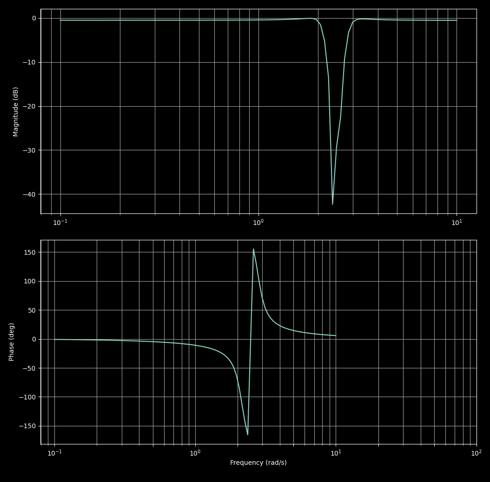
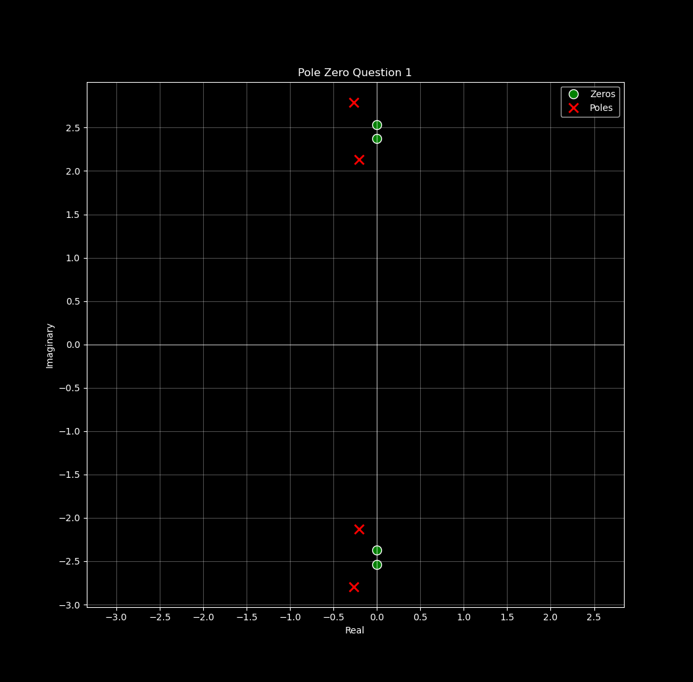
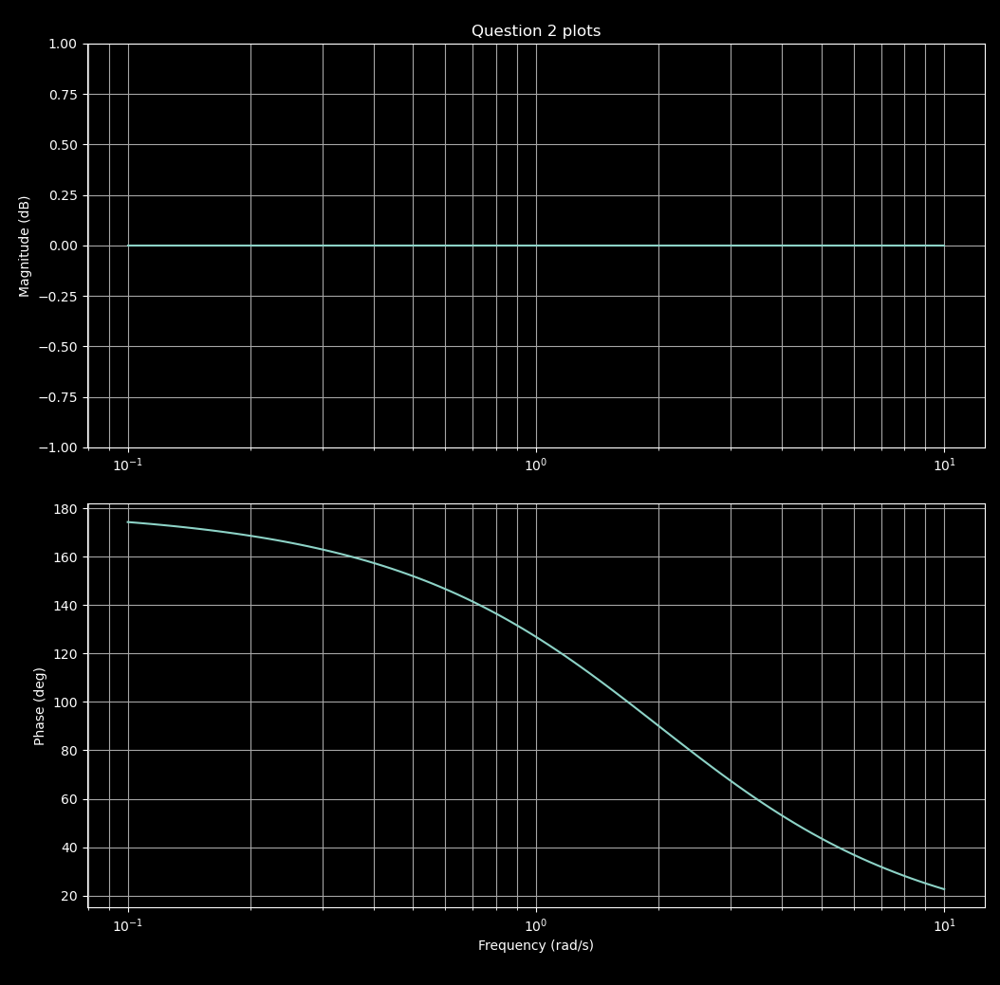
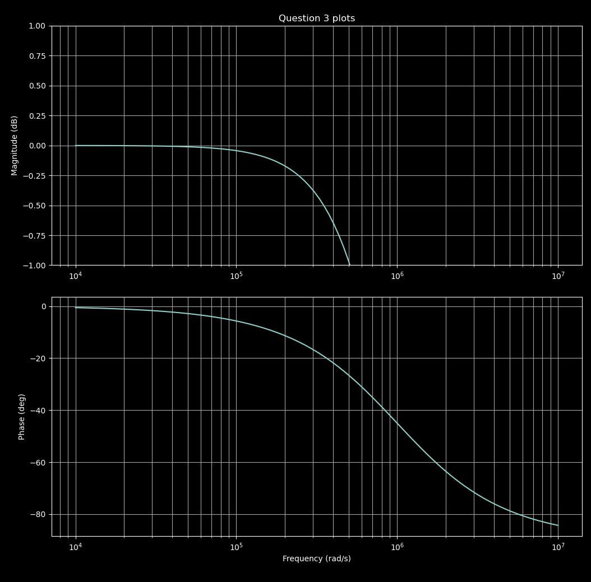
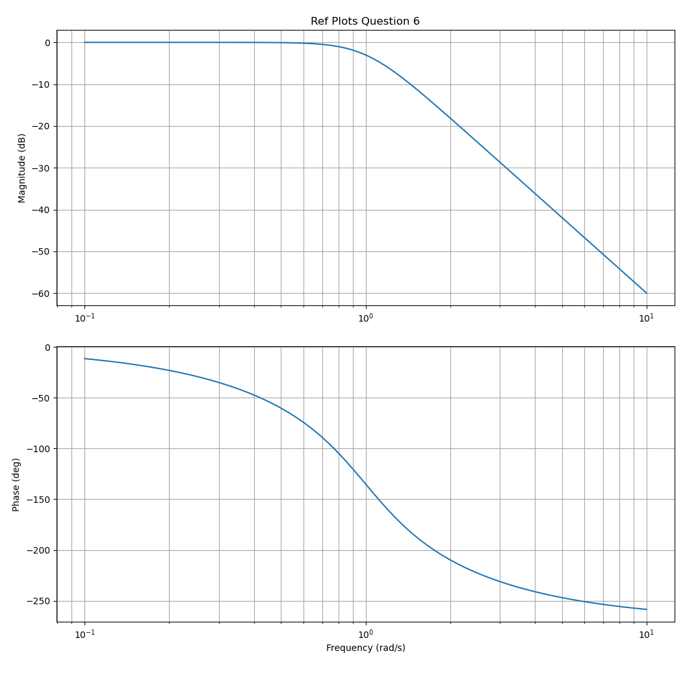
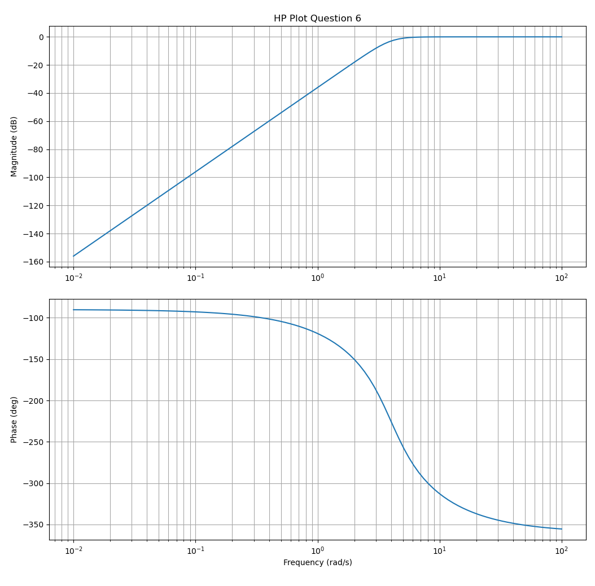
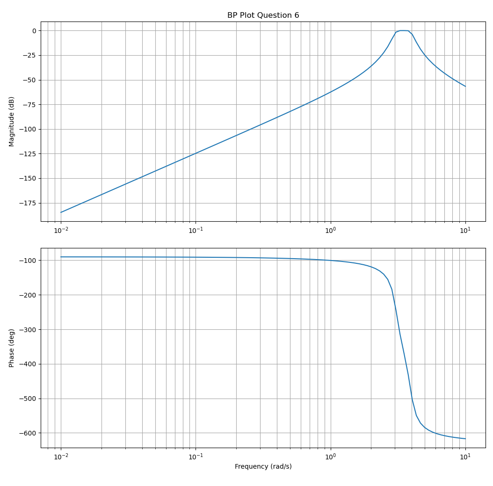

# ECE 444 - Digital Signal Processing
# Homework 2
**Cole Zenk**

---

## Problem 1: Book problem 2.1-5(d)

Determine and plot the poles and zeros of H(s), use the pole and zero information to predict overall system behavior. Confirm your predictions by graphing the system's frequency response (magnitude and phase).

**Given transfer function:**

$$
H(s) = \frac{0.94s^{4} + 11.33s^{2} + 33.99}{s^{4} + 0.94s^{3} + 12.66s^{2} + 5.64s + 36}
$$

To get anything out of this for intuition, the transfer function must be factored. Factoring a 4th order polynomial by hand is impractical when tools like MATLAB or Python are readily available.

```python
>>> import numpy as np
>>> num = [.94, 0, 11.33, 0, 33.99]
>>> den = [1, .94, 12.66, 5.64, 36]
>>> zeros = np.roots(num)
>>> poles = np.roots(den)
>>> print(zeros)
[-2.22e-16+2.535j -2.22e-16-2.535j  2.22e-16+2.372j  2.22e-16-2.372j]
>>> print(poles)
[-0.267+2.792j -0.267-2.792j -0.203+2.129j -0.203-2.129j]
```

**Factored transfer function:**

$$
H(s) = \frac{(s \pm 2.535j)^{2}(s \pm 2.372j)^{2}}{(s + 0.267 \pm 2.792j)^{2}(s + 0.203 \pm 2.129j)^{2}}
$$

This transfer function shows that there will be suppression near 2.372 and 2.535 rad/s, and amplification near 2.792 and 2.129 rad/s. The following plots confirm this.

**Simulation:**
```python
>>> import dsp_sim_utils as now
>>> now.plot_phase_mag(num, den)
>>> now.plot_pole_zero(num, den, 'Pole Zero Question 1')
```




---

## Problem 2: Book problem 2.2-2

Consider the all-pass filter specified by the transfer function:

$$
H(s) = \frac{s-2}{s+2}
$$

Verify the all-pass character of the filter by plotting the system frequency response (magnitude and phase). Can this filter be considered distortionless? Explain.

**Simulation:**
```python
>>> now.plot_phase_mag([1, -2], [1, 2], 'Question 2 plots')
```



**Analysis:** The magnitude plot shows constant 0 dB across all frequencies, confirming all-pass behavior. However, the phase is nonlinear (varies with frequency), so this filter is **not distortionless**. Distortionless transmission requires both constant magnitude AND linear phase.

---

## Problem 3: Book problem 2.3-3

**Circuit:** Series R (1 kΩ) with parallel C (1 nF) to ground, forming a lowpass RC filter.

### Part 1: Find the system transfer function

Using voltage division, the circuit can be analyzed as:

$$
y(t) = x(t) \times \frac{Z_C}{Z_C + Z_R}
$$

$$
Y(s) = X(s) \times \frac{\frac{1}{sC}}{R + \frac{1}{sC}}
$$

$$
H(s) = \frac{1}{sRC + 1}
$$

**With values R = 1 kΩ, C = 1 nF:**

$$
H(s) = \frac{1}{s \times 10^{-6} + 1}
$$

**Cutoff frequency:** $\omega_c = \frac{1}{RC} = 10^6$ rad/s (1 MHz)

### Part 2: Plot the magnitude and phase responses

```python
>>> now.plot_phase_mag([1], [1e-6, 1], 'Question 3 plots', ylim_mag=[-1, 1])
```



### Part 3: Show distortionless transmission for lowpass signals

**Magnitude analysis:**

$$
H(j\omega) = \frac{1}{j\omega \times 10^{-6} + 1}
$$

$$
|H(j\omega)| = \frac{1}{\sqrt{(\omega \times 10^{-6})^{2} + 1}}
$$

For $\omega \ll 10^6$ rad/s: $|H(j\omega)| \approx 1$ (flat passband) ✓

**Phase analysis:**

$$
\angle H(j\omega) = -\tan^{-1}(\omega \times 10^{-6})
$$

By Taylor expansion, for $x \ll 1$:

$$
\arctan(x) = \sum_{n=0}^{\infty}\frac{(-1)^{n}}{2n+1}x^{2n+1} \approx x
$$

For $\omega \ll 10^6$:

$$
\angle H(j\omega) \approx -\omega \times 10^{-6}
$$

This is **linear phase** of the form $\phi(\omega) = -\omega\tau$ where $\tau = RC = 10^{-6}$ seconds.

**In the passband:**

$$
H(j\omega) \approx e^{-j\omega \times 10^{-6}}
$$

$$
Y(j\omega) = X(j\omega) \cdot e^{-j\omega \times 10^{-6}}
$$

**By the Fourier transform shifting property:**

$$
y(t) = x(t - 10^{-6})
$$

**Conclusion:** For any lowpass signal with $\omega \ll 10^6$ rad/s, the output experiences negligible distortion with only a 1 microsecond time delay.

### Part 4: Bandpass signal with carrier

For $x(t) = g(t)\cos(\omega_c t)$ where $\omega_c = 3 \times 10^6$ rad/s and $g(t)$ has 50 Hz bandwidth:

The carrier frequency (3 MHz) is well above the cutoff (1 MHz), experiencing significant attenuation (~10 dB). However, the slowly-varying envelope $g(t)$ (50 Hz) passes through relatively undistorted. The output is approximately:

$$
y(t) \approx K \cdot g(t - 10^{-6}) \cos(3 \times 10^6 t - \phi)
$$

where $K \approx 0.3$ is the attenuation factor at 3 MHz and $\phi$ is the phase shift.

---

## Problem 4: Book problem 2.4-3

For each of the following windows, determine a suitable width T so that when applied to an ideal lowpass filter, the resulting transition band is approximately 1 rad/s.

**Method:** Set main lobe width = 1 rad/s and solve for T.

| Window      | Main Lobe Width   | Equation              | **T (seconds)** |
|-------------|-------------------|-----------------------|-----------------|
| Rectangular | $\frac{4\pi}{T}$  | $\frac{4\pi}{T} = 1$  | **12.57**       |
| Triangular  | $\frac{8\pi}{T}$  | $\frac{8\pi}{T} = 1$  | **25.13**       |
| Hann        | $\frac{8\pi}{T}$  | $\frac{8\pi}{T} = 1$  | **25.13**       |
| Hamming     | $\frac{8\pi}{T}$  | $\frac{8\pi}{T} = 1$  | **25.13**       |
| Blackman    | $\frac{12\pi}{T}$ | $\frac{12\pi}{T} = 1$ | **37.70**       |

---

## Problem 5: Book problem 2.5-1

Consider a microphone intended for use in a music recording studio. Determine a suitable frequency response (lowpass, highpass, bandpass, or bandstop) for the microphone, and provide suitable values (such as $\delta_p$ and $\omega_s$) to specify the response.

**Filter type:** Bandpass

**Rationale:** A music recording studio microphone should capture the full range of musical instruments and human hearing while rejecting out-of-band noise.

**Specifications:**

- **Passband edges:** $\omega_{p1} = 20$ Hz (125.7 rad/s), $\omega_{p2} = 20$ kHz (125,664 rad/s)
- **Stopband edges:** $\omega_{s1} = 10$ Hz (62.8 rad/s), $\omega_{s2} = 25$ kHz (157,080 rad/s)
- **Passband ripple:** $\delta_p = 0.05$ → $\alpha_p = 0.45$ dB
- **Stopband ripple:** $\delta_s = 0.01$ → $\alpha_s = 40$ dB

---

## Problem 6: Book problem 2.6-1(b,c)

Determine the filter H(s) that results by applying the following transformations on a lowpass prototype filter:

$$
H_p(s) = \frac{1}{s^{3} + 2s^{2} + 2s + 1}
$$

Plot the corresponding magnitude response. In each case, designate $\omega_0$ as the prototype's 1-dB cutoff frequency.

### Finding $\omega_0$

Using numerical methods:

```python
>>> omega_0 = find_omega_0([1], [1, 2, 2, 1], cutoff_db=-1)
>>> print(omega_0)
0.798 rad/s
```



### Part (b): Lowpass-to-Highpass transformation with $\omega_1 = 5$ rad/s

**Transformation:** $s \to \frac{\omega_0 \omega_1}{s} = \frac{3.99}{s}$

**Result:**

$$
H_{HP}(s) = \frac{s^{3}}{s^{3} + 7.98s^{2} + 31.84s + 63.52}
$$

```python
>>> k = omega_0 * omega_1
>>> num_hp = [1, 0, 0, 0]
>>> den_hp = [1, 2*k, 2*k**2, k**3]
>>> now.plot_phase_mag(num_hp, den_hp, 'HP Plot Question 6')
```



### Part (c): Lowpass-to-Bandpass transformation with $\omega_1 = 3$ rad/s, $\omega_2 = 4$ rad/s

**Transformation:** $s \to \frac{s^{2} + \omega_1\omega_2}{s(\omega_2 - \omega_1)} = \frac{s^{2} + 12}{s}$

**Result (from symbolic computation):**

$$
H_{BP}(s) = \frac{s^{3}}{s^{6} + 2s^{5} + 38s^{4} + 49s^{3} + 456s^{2} + 288s + 1728}
$$

```python
>>> num_bp = [1, 0, 0, 0]
>>> den_bp = [1, 2, 38, 49, 456, 288, 1728]
>>> now.plot_phase_mag(num_bp, den_bp, 'BP Plot Question 6')
```



**Note:** The bandpass filter is 6th order (double the prototype order), which is expected for LP→BP transformations.


---

## Appendix: Python Utilities

All simulations used the `dsp_sim_utils.py` module:

```python
# ECE 444 - Digital Signal Processing
# Homework 2
**Cole Zenk**

---

## Problem 1: Book problem 2.1-5(d)

Determine and plot the poles and zeros of H(s), use the pole and zero information to predict overall system behavior. Confirm your predictions by graphing the system's frequency response (magnitude and phase).

**Given transfer function:**

$$
H(s) = \frac{0.94s^{4} + 11.33s^{2} + 33.99}{s^{4} + 0.94s^{3} + 12.66s^{2} + 5.64s + 36}
$$

To get anything out of this for intuition, the transfer function must be factored. Factoring a 4th order polynomial by hand is impractical when tools like MATLAB or Python are readily available.

```python
>>> import numpy as np
>>> num = [.94, 0, 11.33, 0, 33.99]
>>> den = [1, .94, 12.66, 5.64, 36]
>>> zeros = np.roots(num)
>>> poles = np.roots(den)
>>> print(zeros)
[-2.22e-16+2.535j -2.22e-16-2.535j  2.22e-16+2.372j  2.22e-16-2.372j]
>>> print(poles)
[-0.267+2.792j -0.267-2.792j -0.203+2.129j -0.203-2.129j]
```

**Factored transfer function:**

$$
H(s) = \frac{(s \pm 2.535j)^{2}(s \pm 2.372j)^{2}}{(s + 0.267 \pm 2.792j)^{2}(s + 0.203 \pm 2.129j)^{2}}
$$

This transfer function shows that there will be suppression near 2.372 and 2.535 rad/s, and amplification near 2.792 and 2.129 rad/s. The following plots confirm this.

**Simulation:**
```python
>>> import dsp_sim_utils as now
>>> now.plot_phase_mag(num, den)
>>> now.plot_pole_zero(num, den, 'Pole Zero Question 1')
```


---

## Problem 2: Book problem 2.2-2

Consider the all-pass filter specified by the transfer function:

$$
H(s) = \frac{s-2}{s+2}
$$

Verify the all-pass character of the filter by plotting the system frequency response (magnitude and phase). Can this filter be considered distortionless? Explain.

**Simulation:**
```python
>>> now.plot_phase_mag([1, -2], [1, 2], 'Question 2 plots')
```


**Analysis:** The magnitude plot shows constant 0 dB across all frequencies, confirming all-pass behavior. However, the phase is nonlinear (varies with frequency), so this filter is **not distortionless**. Distortionless transmission requires both constant magnitude AND linear phase.

---

## Problem 3: Book problem 2.3-3

**Circuit:** Series R (1 kΩ) with parallel C (1 nF) to ground, forming a lowpass RC filter.

### Part 1: Find the system transfer function

Using voltage division, the circuit can be analyzed as:

$$
y(t) = x(t) \times \frac{Z_C}{Z_C + Z_R}
$$

$$
Y(s) = X(s) \times \frac{\frac{1}{sC}}{R + \frac{1}{sC}}
$$

$$
H(s) = \frac{1}{sRC + 1}
$$

**With values R = 1 kΩ, C = 1 nF:**

$$
H(s) = \frac{1}{s \times 10^{-6} + 1}
$$

**Cutoff frequency:** $\omega_c = \frac{1}{RC} = 10^6$ rad/s (1 MHz)

### Part 2: Plot the magnitude and phase responses

```python
>>> now.plot_phase_mag([1], [1e-6, 1], 'Question 3 plots', ylim_mag=[-1, 1])
```


### Part 3: Show distortionless transmission for lowpass signals

**Magnitude analysis:**

$$
H(j\omega) = \frac{1}{j\omega \times 10^{-6} + 1}
$$

$$
|H(j\omega)| = \frac{1}{\sqrt{(\omega \times 10^{-6})^{2} + 1}}
$$

For $\omega \ll 10^6$ rad/s: $|H(j\omega)| \approx 1$ (flat passband) ✓

**Phase analysis:**

$$
\angle H(j\omega) = -\tan^{-1}(\omega \times 10^{-6})
$$

By Taylor expansion, for $x \ll 1$:

$$
\arctan(x) = \sum_{n=0}^{\infty}\frac{(-1)^{n}}{2n+1}x^{2n+1} \approx x
$$

For $\omega \ll 10^6$:

$$
\angle H(j\omega) \approx -\omega \times 10^{-6}
$$

This is **linear phase** of the form $\phi(\omega) = -\omega\tau$ where $\tau = RC = 10^{-6}$ seconds.

**In the passband:**

$$
H(j\omega) \approx e^{-j\omega \times 10^{-6}}
$$

$$
Y(j\omega) = X(j\omega) \cdot e^{-j\omega \times 10^{-6}}
$$

**By the Fourier transform shifting property:**

$$
y(t) = x(t - 10^{-6})
$$

**Conclusion:** For any lowpass signal with $\omega \ll 10^6$ rad/s, the output experiences negligible distortion with only a 1 microsecond time delay.

### Part 4: Bandpass signal with carrier

For $x(t) = g(t)\cos(\omega_c t)$ where $\omega_c = 3 \times 10^6$ rad/s and $g(t)$ has 50 Hz bandwidth:

The carrier frequency (3 MHz) is well above the cutoff (1 MHz), experiencing significant attenuation (~10 dB). However, the slowly-varying envelope $g(t)$ (50 Hz) passes through relatively undistorted. The output is approximately:

$$
y(t) \approx K \cdot g(t - 10^{-6}) \cos(3 \times 10^6 t - \phi)
$$

where $K \approx 0.3$ is the attenuation factor at 3 MHz and $\phi$ is the phase shift.

---

## Problem 4: Book problem 2.4-3

For each of the following windows, determine a suitable width T so that when applied to an ideal lowpass filter, the resulting transition band is approximately 1 rad/s.

**Method:** Set main lobe width = 1 rad/s and solve for T.

| Window | Main Lobe Width | Equation | **T (seconds)** |
|--------|----------------|----------|-----------------|
| Rectangular | $\frac{4\pi}{T}$ | $\frac{4\pi}{T} = 1$ | **12.57** |
| Triangular | $\frac{8\pi}{T}$ | $\frac{8\pi}{T} = 1$ | **25.13** |
| Hann | $\frac{8\pi}{T}$ | $\frac{8\pi}{T} = 1$ | **25.13** |
| Hamming | $\frac{8\pi}{T}$ | $\frac{8\pi}{T} = 1$ | **25.13** |
| Blackman | $\frac{12\pi}{T}$ | $\frac{12\pi}{T} = 1$ | **37.70** |

---

## Problem 5: Book problem 2.5-1

Consider a microphone intended for use in a music recording studio. Determine a suitable frequency response (lowpass, highpass, bandpass, or bandstop) for the microphone, and provide suitable values (such as $\delta_p$ and $\omega_s$) to specify the response.

**Filter type:** Bandpass

**Rationale:** A music recording studio microphone should capture the full range of musical instruments and human hearing while rejecting out-of-band noise.

**Specifications:**

- **Passband edges:** $\omega_{p1} = 20$ Hz (125.7 rad/s), $\omega_{p2} = 20$ kHz (125,664 rad/s)
- **Stopband edges:** $\omega_{s1} = 10$ Hz (62.8 rad/s), $\omega_{s2} = 25$ kHz (157,080 rad/s)
- **Passband ripple:** $\delta_p = 0.05$ → $\alpha_p = 0.45$ dB
- **Stopband ripple:** $\delta_s = 0.01$ → $\alpha_s = 40$ dB

---

## Problem 6: Book problem 2.6-1(b,c)

Determine the filter H(s) that results by applying the following transformations on a lowpass prototype filter:

$$
H_p(s) = \frac{1}{s^{3} + 2s^{2} + 2s + 1}
$$

Plot the corresponding magnitude response. In each case, designate $\omega_0$ as the prototype's 1-dB cutoff frequency.

### Finding $\omega_0$

Using numerical methods:

```python
>>> omega_0 = find_omega_0([1], [1, 2, 2, 1], cutoff_db=-1)
>>> print(omega_0)
0.798 rad/s
```


### Part (b): Lowpass-to-Highpass transformation with $\omega_1 = 5$ rad/s

**Transformation:** $s \to \frac{\omega_0 \omega_1}{s} = \frac{3.99}{s}$

**Result:**

$$
H_{HP}(s) = \frac{s^{3}}{s^{3} + 7.98s^{2} + 31.84s + 63.52}
$$

```python
>>> k = omega_0 * omega_1
>>> num_hp = [1, 0, 0, 0]
>>> den_hp = [1, 2*k, 2*k**2, k**3]
>>> now.plot_phase_mag(num_hp, den_hp, 'HP Plot Question 6')
```


### Part (c): Lowpass-to-Bandpass transformation with $\omega_1 = 3$ rad/s, $\omega_2 = 4$ rad/s

**Transformation:** $s \to \frac{s^{2} + \omega_1\omega_2}{s(\omega_2 - \omega_1)} = \frac{s^{2} + 12}{s}$

**Result (from symbolic computation):**

$$
H_{BP}(s) = \frac{s^{3}}{s^{6} + 2s^{5} + 38s^{4} + 49s^{3} + 456s^{2} + 288s + 1728}
$$

```python
>>> num_bp = [1, 0, 0, 0]
>>> den_bp = [1, 2, 38, 49, 456, 288, 1728]
>>> now.plot_phase_mag(num_bp, den_bp, 'BP Plot Question 6')
```


**Note:** The bandpass filter is 6th order (double the prototype order), which is expected for LP→BP transformations.

---

## Problem 7: Book problem 2.6-3(a,c,d)

*[Not completed]*

---

## Appendix: Python Utilities

All simulations used the `dsp_sim_utils.py` module:

```python
import matplotlib.pyplot as plot
from scipy import signal
import numpy as np

def plot_phase_mag(num, den, title=None, save_path=None, ylim_mag=None):
    """Plot Bode magnitude and phase response"""
    # Implementation in dsp_sim_utils.py

def plot_pole_zero(num, den, title=None, save_path=None):
    """Plot pole-zero diagram"""
    # Implementation in dsp_sim_utils.py

def find_omega_0(num, den, cutoff_db=-1):
    """Find cutoff frequency for a given dB level"""
    # Implementation in dsp_sim_utils.py
```
```
