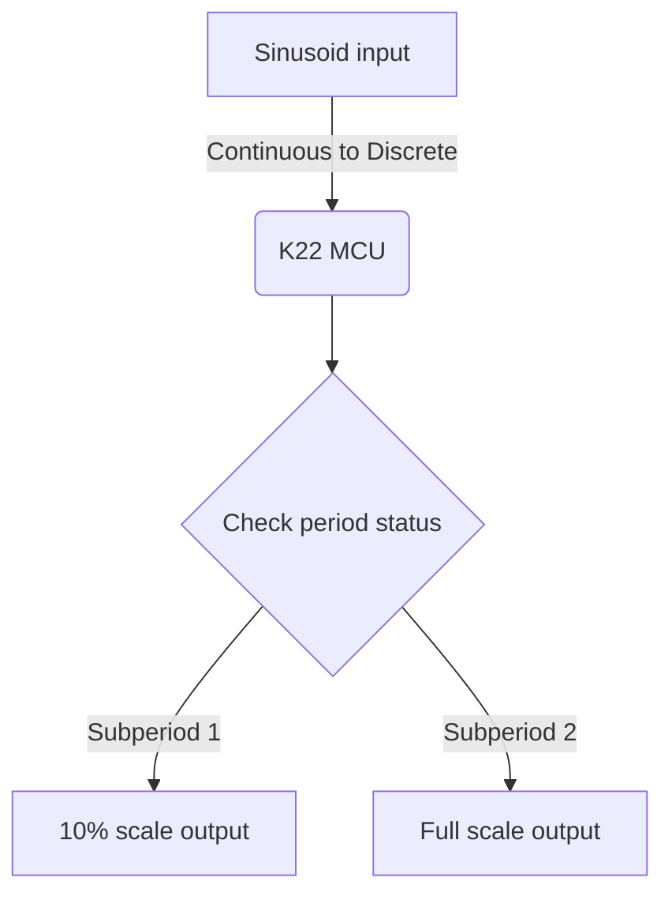

# Assignment 1

Given the [prompt](./Doc/Assignment_1.md) I have decided to take an approach that I will document in a series of markdown files.

## Approach

### Obtaining Necessary Dev Tools
- Given my main machine is currently running Arch Linux as of Jan 2026, installing the IDE with the provided zips will be pointless (not a fan of IDEs anyways).

- Typically, my preferred approach to embedded development is to use command line interface (CLI) build tools. This led me to research CLI alternatives to the proposed IDE. This is where the fun comes in as there really isn't a supported CLI toolchain provided by NXP like esp-idf for ESP32, so I have opted to use OpenOCD for flashing and the standard ARM GCC toolchain for compiling.

For any other Arch users:
```bash
sudo pacman -S arm-none-eabi-gcc arm-none-eabi-newlib arm-none-eabi-gdb
sudo pacman -S openocd

# Download CMSIS headers
wget https://github.com/ARM-software/CMSIS_5/archive/refs/heads/develop.zip
unzip develop.zip
mkdir -p RTE/CMSIS
cp -r CMSIS_5-develop/CMSIS/Core/Include/* RTE/CMSIS/
rm -rf CMSIS_5-develop develop.zip
```

The main compromise (if you really want to call it that) is that a [Makefile](./Makefile) is now required for projects.

### Verification
I started with verifying that OpenOCD worked first. You don't have to, I just did.

To do this I:
1. Installed OpenOCD
2. Connected the NXP board and checked if it was seen by my machine with `lsusb`, which it was when I connected to the left port (with the ports facing you)
3. Then I checked what OpenOCD supported:
```bash
ls /usr/share/openocd/scripts/board/ | grep -i frdm
# Output:
frdm-kl25z.cfg
frdm-kl46z.cfg
nxp_frdm-k64f.cfg
nxp_frdm-ls1012a.cfg
```
Which is alarming since the specific K22F board isn't listed, but the KX family target config worked.

4. For one final check I entered the command:
```bash
openocd -f interface/jlink.cfg -c "transport select swd" -c "adapter speed 1000" -f target/kx.cfg
```
Success! The board was detected as a Cortex-M4.

### Creating a New Project
Since I don't believe in IDEs, I cannot rely on a project wizard to give me a project architecture (they usually aren't very good anyways). To create a sensible architecture I executed:
```bash
mkdir -p src inc build
```

I downloaded the framework zip provided on Blackboard and organized the project structure:
```bash
# Copy source files
cp K22_Project_Framework_F20/main.c ./src/
cp K22_Project_Framework_F20/ADC.c ./src/
cp K22_Project_Framework_F20/DAC.c ./src/
cp K22_Project_Framework_F20/MCG.c ./src/
cp K22_Project_Framework_F20/TimerInt.c ./src/
cp K22_Project_Framework_F20/RTE/Device/MK22FN512VLH12/system_MK22F51212.c ./src/

# Copy headers
cp K22_Project_Framework_F20/*.h ./inc/

# Copy device specific files
cp -r K22_Project_Framework_F20/RTE ./

# Copy startup file (note: had to convert from Keil to GCC syntax)
cp startup_MK22F51212_gcc.s ./
```

**Note:** The provided startup file was in Keil assembly syntax, which is incompatible with GCC. I created a GCC-compatible version that includes the interrupt vector table and Reset_Handler.

I also created:
- **Makefile**: Handles compilation, linking, and flashing
- **linker_script.ld**: Defines memory layout (512KB Flash @ 0x0, 128KB RAM @ 0x1FFF0000)

### Build and Flash
```bash
# Build firmware
make

# Flash to board
make flash
```

Build output:
```
text    data     bss     dec     hex filename
4404     116     516    5036    13ac build/warbling_wire.elf
```

Successfully flashed and verified!
---
## Clock Configuration

The K22F is configured for 120MHz core clock from an 8MHz external crystal
(see [MCG.c](./src/MCG.c)). HSRUN mode is enabled to allow operation above 80MHz.

| Domain  | Frequency | Divider        |
|---------|-----------|----------------|
| Core    | 120 MHz   | OUTDIV1=0 (÷1) |
| Bus     | 60  MHz   | OUTDIV2=1 (÷2) |
| FlexBus | 30  MHz   | OUTDIV3=3 (÷4) |
| Flash   | 24  MHz   | OUTDIV4=4 (÷5) |

PIT runs on the bus clock, so for Fs = 10kHz:
```
LDVAL = (60MHz / 10kHz) - 1 = 5999
```

Note: `RTE_Device.h` defines `RTE_BUSCLK = 48000000` but this is incorrect
for the HSRUN configuration. The actual bus clock is determined by [MCG.c](./src/MCG.c).

---

# Defining the Algorithm Used
The way I look at the question is like this:
- There will be a periodic input.
- The output will need to be that of some peridic input multiplied by yet another periodic input.
- The phases of course, must be different.
- There are multiple ways this algorithm could take form, I feel that using a sinusoid is the easiest for me to understand personally.

So at this point we know that our main engine of this transformer will look something like:

$$
Y(t) = sin(\omega t) X(t)
$$

With omega at this point, being some arbitrary phase shift.

I think that a reasonable implementation for a filter like s is a simple low-pass filter approach.
This will make the output look a little more like

$$
y(n) = y(n-1) + (1 -a) |x(n)|
$$

only thing is, this needs to be dyanmically changing (albeit with a static frequency). Also it shouldn't be filtering...
So it should just affect the gain!

## Observing Dyanamic Gain Implementations
We know it must
- Reach a max at 0 or 2pi
- Reach a min at pi
- Go up to a gain of one, or down to a gain of .1

So we know what a standard sine formula will look like...

$$
f(t) = \delta + \alpha sin( \omega t)
$$

So this yeilds 2 equations and 2 unknowns:

$$
 \delta + \alpha  = 1 \\\\
 \delta - \alpha = .1 \\\\
==> \delta = frac{1.1}{2} = 0.55 \\\\
    \alpha = 1 - \delta = 0.45
$$

## Finding the Frequency
uhhh, 3HZ. Because why not. It will need to be normalized by deviding by 10 KHz and mulitplying by 2pi. (and also reset when it reaches above 2pi ideally)

# NOTES
- We know we'll have to have:
  - 0-3V
  - Sinusoid?
  - Looking at some of the images in describing the chip architecture will be helpful.(maybe look at the source code or the datasheets at times)

## End Goal
Convert:
1. Analog to
2. Digital
3. Altered digital
4. Back to analog

I.e.

start with aquisition, --> Implement an algorithm that transforms inputs --> output the transformed function


---

# TODO List
* [X] Confgure Fs to run at 10 KHz
* [X] Obtain the software and flash the board
* [X] Start ADC conversion and read previous result
* [X] Apply warble envelope
* [X] Write to DAC (12-bit)
